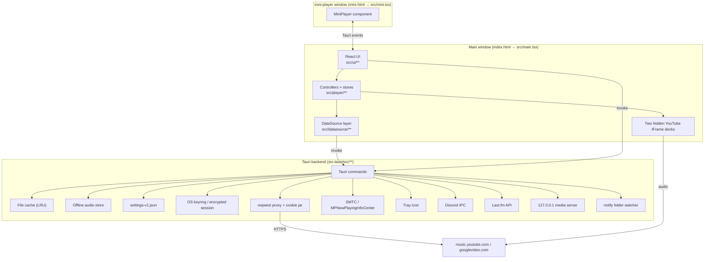

# Architecture — Zuno

An unofficial desktop YouTube Music client. Tauri 2 (Rust) shell + React 19 / TypeScript
front end, bundled by Vite 7. No router and no Redux — plain classes with `useSyncExternalStore`
and direct Tauri IPC. The UI is built on Tailwind v4 plus animated components vendored from the
[beUI](https://beui.dev) registry, with [Solar](https://solar-icons.vercel.app) icons.

- Version: `1.2.1` (`package.json`, `src-tauri/Cargo.toml`, `src-tauri/tauri.conf.json` are kept in lockstep)
- Bundle id: `com.zuno.desktop` · Rust crate `zuno` / lib `zuno_lib`
- Platforms: Windows, macOS, Linux
- Companion docs: [frontend.md](./frontend.md) (UI), [backend.md](./backend.md) (Rust/IPC)

---

## 1. Big picture



Four rules explain most of the design:

1. **All network traffic to Google goes through Rust** (`proxy_http_request`) so the WebView's
   CORS/cookie rules never apply, cookie auth can be signed properly, and rotated `Set-Cookie`
   values can be merged back into the stored session.
2. **Streaming audio is played by YouTube's own IFrame player**, not by `<audio>` — this dodges the
   403s that signed googlevideo URLs return when replayed from a different context. Native `<audio>`
   serves local files and *downloaded* tracks.
3. **Downloads are a separate path from playback.** `offline_audio_save` fetches the same signed URL
   in Rust with a PO token, in 4 MiB ranges, and stores the bytes on disk; playback of a downloaded
   track then never touches the network.
4. **Every piece of durable state has two homes**: `localStorage` (synchronous, drives the UI)
   and a Rust-owned JSON file (survives WebView data wipes). See §6.

---

## 2. Process and window model

| Window | Label | Entry | Notes |
|---|---|---|---|
| Main | `main` | `index.html` → `src/main.tsx` | 1280×900, min 900×600, `decorations: false`, `transparent: true`, `shadow: false` (custom title bar and window edge; Linux forces decorations on at runtime) |
| Mini player | `mini-player` | `mini.html` → `src/mini.tsx` | transparent, always-on-top, `skipTaskbar`, shown when the main window is backgrounded or minimized |
| Sign-in | `youtube-music-login` | Google sign-in URL | Created on demand by Rust during `sign_in_youtube_music` (and headlessly by `refresh_youtube_music_cookie`), destroyed after the session cookie appears |

Vite is configured with two Rollup inputs (`vite.config.ts`), so main and mini ship as separate
HTML entry points sharing the same module graph. `@` is aliased to `src/`.

**Production frontend hosting is unusual.** In release builds `run()` picks a free port, serves
`dist/` through `tauri-plugin-localhost`, and rewrites `frontend_dist` to `http://localhost:<port>`.
The YouTube IFrame API refuses to run under the `tauri://` / `asset://` origins, so the app needs a
real `http://` origin. Dev builds use the normal Vite dev server on port 1420.

**Rust → frontend events:**

| Event | Emitted when | Consumed by |
|---|---|---|
| `main-window-backgrounded` | main window loses focus and mini player isn't focused (100 ms debounce) | `App.tsx` — shows the mini player |
| `main-window-minimized` | same check, but the window turned out to be minimized | `App.tsx` — shows the mini player even during drag suppression |
| `window-focused` | main window regains focus | `App.tsx` — hides the mini player, triggers connection recovery |
| `windows-media-control` | SMTC or taskbar thumbnail button pressed | `useMediaSession` |
| `offline-download-progress` | per-chunk progress during `offline_audio_save` | `player/offlineStore.ts` |
| `local-audio-changed` | `notify` watcher sees a change under a watched music folder | `main.tsx` → `notifyLocalPlaylistsChanged()` |

**Mini ↔ main** is a set of plain Tauri events, no shared controllers:
main emits `player-state-sync` / `player-time-sync` / `player-volume-sync`; the mini window emits
`mini-player:request-sync`, `:toggle-play-pause`, `:skip-next`, `:skip-previous`, `:seek`,
`:volume`, `:position-changed`, `:restore-main`.

---

## 3. Layers

```
src/
├─ main.tsx / mini.tsx      bootstrap: settings hydration, error hooks, React root
├─ internal/                cross-cutting: cache, app settings, logging, updater, equality helpers
├─ datasource/              "where does music come from" — abstract API + YouTube Music impl
├─ player/                  playback engine, queue, tabs, library, offline, integrations
├─ components/              vendored beUI primitives (registry paths, do not restructure)
├─ lib/                     beUI helpers: cn, ease tokens, use-hover-capable
└─ ui/                      app components, pages, settings modules, stores, icons.tsx
```

Dependency direction is strictly downward: `ui → player → datasource → internal → Tauri IPC`.
Nothing in `datasource/` imports from `ui/`.

Alongside the source, `*.check.ts` files hold executable assertions for the non-trivial pure logic
(queue moves, lyric timing, artwork picking, translation parsing, playlist transfer, prop equality,
…). `npm run check` bundles and runs each in its own process — see §8.

### 3.1 `internal/` — cross-cutting utilities

| Module | Responsibility |
|---|---|
| `cache.ts` | Thin wrapper over the Rust file cache (`cache_get/set/stats/clear`). JSON in, JSON out. Default budget 4 GiB. |
| `appSettings.ts` | `app_setting_get/set/remove` + `app_settings_clear`. Never throws (except `clear`). |
| `durableLocalSetting.ts` | The localStorage ⇄ durable-settings mirroring helpers (`read/write/hydrateLocal{Boolean,Json}Setting`). Every settings module in `ui/settings/` is built on these. |
| `logging.ts` | `logInternalDebug/Info/Warn/Error`. Redacts cookies, tokens, authorization headers and full URLs before forwarding to Rust via `frontend_log`, then also mirrors to the console. |
| `updateChecker.ts` | `tauri-plugin-updater` wrapper; on macOS it degrades to a GitHub Releases API check (notify-only, no in-app install). 24 h per-version snooze in localStorage. |
| `releaseNote.ts` | The one-time "what's new" note, keyed to the installed version rather than a flag. |
| `artworkCache.ts` | Remembers which artwork candidate URL actually loaded, per source URL, so remounts don't rewalk the fallback chain. Hydrated before React mounts. |
| `audioQuality.ts` | Streaming and download quality caps, set independently. |
| `lyricsSourcePreference.ts` | Which lyric provider is promoted to the front of the race. A preference, not a restriction. |
| `base64.ts` | Byte-oriented base64 for binary payloads crossing IPC (`btoa` is Latin-1 only). |
| `shallowEqual.ts` / `propsEqual.ts` | One-level equality for store selectors and for `memo` on components handed inline arrows. |

### 3.2 `datasource/` — content abstraction

`DataSource` (`datasource/DataSource.ts`) is an abstract class where *everything except
`getTrack` and `getStreamUrl` is optional*. Controllers feature-detect (`this.dataSource.getLyrics?.(…)`),
so a partial implementation degrades gracefully instead of crashing. The optional surface now covers
search, link resolution, session lifecycle, multi-account (`listAccounts` / `selectAccount`),
library, albums, artists (subscribe, notification level), playlists (create/rename/describe/delete/
reorder/add/remove), likes and ratings, notifications, recommendations, related shelves, browse
pages, and lyrics.

Domain types live in `datasource/types.ts`: `Track`, `Album`, `Playlist`, `Artist`, `ArtistPage`,
`SearchResults`, `TrackPage`, `Lyrics`, `BrowsePage`/`BrowseShelf`/`BrowseTarget`, `FeedNotification`,
`AccountOption`/`AccountProfile`, `AuthPrompt`/`AuthProgress`, `LibrarySnapshot`. `Track.source` is
`"youtube" | "local"` — the single discriminator that routes local files down a different
playback path.

| File | Role |
|---|---|
| `youtube/YouTubeMusicDataSource.ts` | **The only implementation wired up.** ~6.1k lines. Owns Innertube clients, library/playlist/album/artist fetching, browse surfaces, search, recommendations, likes, ratings, notifications, accounts, lyrics, and stream resolution. |
| `youtube/tauriFetch.ts` | `fetch`-shaped adapter that funnels youtubei.js through `proxy_http_request`. Computes the `SAPISIDHASH` authorization header, sets `origin`/`referer` to `music.youtube.com`, and rewrites `www.youtube.com/youtubei/*` → `music.youtube.com` when the client id is `67` (YouTube Music). |
| `youtube/poToken.ts` | Proof-of-Origin token minting via `bgutils-js`. Signed googlevideo URLs are only served to a session that can prove it came from a real browser; without it the second and later downloads 403. |
| `youtube/lyricsSources.ts` | The provider table. Sources are grouped into waves: wave 1 is raced in parallel, wave 2 (the expensive YouTube calls) only runs if wave 1 came back empty. Per-source `timeoutMs` and a `LyricsSourceAttempt` trail for the UI. |
| `youtube/links.ts` | Parses a pasted YouTube / YouTube Music URL without a network round-trip; returns null for the shapes that genuinely need the API (`@handles`, `youtu.be` redirects, vanity channels). |
| `youtube/artwork.ts` | Walks arbitrary Innertube response objects collecting `{url,width,height}` candidates and picks the largest; plus `i.ytimg.com` fallbacks by video id. |
| `translate.ts` | Lyric translation through Google's keyless `translate_a` endpoint. Every failure is normal: a miss returns null and the caller shows the original words. |
| `youtube/YouTubeDataSource.ts` | **Dead code.** Older non-Music implementation, no longer imported anywhere (see §9). |

Caching inside the data source is a consistent stale-while-revalidate pattern:

```
getX() → read cache → if usable, return it and kick off a background refresh
                    → else await refresh, write cache, return
refresh promises are deduped per key in a Map so concurrent callers share one request
```

Cache keys are versioned strings (`youtube-music:library:v5`, `youtube-music:track:v1:<id>`,
`lyrics:synced:v2:<id>`, …); bumping the version is how you invalidate a schema change.

### 3.3 `player/` — playback and app state

| Module | Responsibility |
|---|---|
| `AudioEngine.ts` | Owns **two** hidden YouTube IFrame decks plus an optional `HTMLAudioElement`. The standby deck holds the *next* track already cued, which is what makes transitions gapless; with a non-zero crossfade the two decks' volumes are ramped past each other. A module-level `playbackClaimId` + `playbackOwner` pair guarantees only one engine makes sound at a time; an idle standby is freed after a timeout. |
| `Queue.ts` | Pure queue data structure with three regions: played/current, a **manual queue** segment (`playNext` / `addToQueue`), and automatic upcoming tracks. Shuffle only touches the automatic region and remembers the original order so it can be restored. `move()` rejects cross-region moves. |
| `PlayerController.ts` | One per tab. Orchestrates DataSource → AudioEngine → Queue, playback order (shuffle and repeat compose independently), crossfade/gapless settings, playback rate, stop-after-track, radio/autoplay refills, history, error surfacing, session export/restore, and Discord presence updates. |
| `TabManager.ts` | Owns the `Map<tabId, PlayerController>`. Distinguishes the **focused** tab (what you're looking at) from the **playback owner** (what's making sound), and suspends/resumes engines on switch. |
| `playerStore.ts` | Composition root: constructs the data source and the three controllers, restores the persisted session, and exposes `usePlayerState` / `usePlayerSelector` / `usePlayerSession` / `useLibraryState` plus an `ActivePlayerController` facade that always targets the right tab. |
| `LibraryController.ts` | Sign-in/out, account switching, staged auth progress (`browser → session → library`), library snapshot loading with timeouts and post-sign-in retries, silent session recovery, optimistic like/rating mutations with rollback, and local-playlist merging. |
| `SearchController.ts` | Trims queries, falls back from `search` to `searchTracks`, forwards streaming `onUpdate` callbacks. |
| `offlineStore.ts` | Download queue and manifest. Statuses `absent → queued → downloading → ready \| failed`, a byte ceiling (default 8 GiB), progress fed by the `offline-download-progress` event, and `useOfflineState()` for the UI. |
| `playHistory.ts` | Local play log (500 entries, oldest trimmed) behind the History page. A replay inside a short window updates the existing entry instead of appending. |
| `localPlaylists.ts` | Local-file playlists: folder paths, per-playlist added tracks, ordering — all in localStorage, resolved through `local_audio_scan`, kept live by the folder watcher. |
| `playlistMembership.ts` | Remembers which playlists a track is in (1000 tracks, pruned oldest-first) so the context menu can render without a round-trip. |
| `playlistTransfer.ts` | Versioned JSON export/import of playlists. |
| `recentPlaylists.ts` | Last-played timestamps per playlist for sidebar ordering. |
| `playbackSettings.ts` | Volume/mute, playback rate, crossfade seconds, gapless flag — mirrored to durable settings. |
| `appSession.ts` | Whole-app session snapshot in localStorage: tabs + per-tab player sessions. Restores `playing` as `paused` so launching the app never autoplays. Honours the "restore tabs and queues" setting. |
| `DiscordRPC.ts` | Sanitizes presence payloads (128-char text limit, HTTPS-only artwork from a trusted host allowlist) before invoking Rust. |
| `LastFm.ts` | Tracks listened seconds, sends `nowPlaying` once per track and scrobbles at `min(240 s, duration/2)`; tracks shorter than 31 s never scrobble. |
| `useMediaSession.ts` | Bridges player state to Windows SMTC (via `update_windows_media_session` + `windows-media-control` events) or, elsewhere, the WebView `navigator.mediaSession`. |
| `shuffleTracks.ts` | Fisher–Yates helper. |
| `Recommender.ts` | **Dead code** — returns `[]`, nothing imports it. |

### 3.4 `ui/` — React

Detailed in [frontend.md](./frontend.md). Summary: `App.tsx` is the single stateful root
(tabs, navigation history, onboarding, updates, window/mini-player wiring, global shortcuts);
every page below it is `lazy`-loaded, and everything else is presentational or reads a store hook
directly.

### 3.5 `src-tauri/src/` — Rust

Detailed in [backend.md](./backend.md).

| File | Responsibility |
|---|---|
| `main.rs` | Sets the Windows AppUserModelID, strips the WebView2 diagnostics env var, calls `run()` |
| `lib.rs` (~3.8k lines) | Commands, cache, settings, logging, keyring/session + cookie jar, HTTP proxy, audio fetch, offline store, local files and tags, folder watcher, media server, tray, window event wiring |
| `discord_rpc.rs` | `DiscordIpcClient` lifecycle and activity building |
| `lastfm.rs` | MD5-signed Last.fm API calls, session in keyring |
| `windows_media.rs` | SMTC integration + taskbar thumbnail toolbar buttons |
| `macos_media.rs` | `MPNowPlayingInfoCenter` integration |

---

## 4. Key flows

### 4.1 Boot

```
main.tsx
  hydrateArtworkCache()              → before paint, so no fallback-icon flash
  applyPlatformAttributes()          → data-platform-linux on <html>
  applyTheme() + watchSystemTheme()  → data-theme; "system" keeps following the OS
  applyPaperPcMode()                 → data-paper-pc (reduced-motion / no blur theme)
  applyNativeWindowControls()        → window decorations on/off
  hydrateMainWindowGeometry() → restoreMainWindowGeometry()
  Promise.all([ ~17 hydrate* calls: paperPc, theme, windowControls, miniPlayer, playerControls,
                queuePanel, tray, audioQuality, lastFm, discord, sidebar, keyboardShortcuts,
                toolbarItems, homeSections, playbackSettings, playHistory, sessionRestore ])
  DiscordRpcService.init()
  window error / unhandledrejection hooks
  createRoot().render(<StrictMode><ErrorBoundary><App/></ErrorBoundary></StrictMode>)
  syncLocalAudioWatcher() + listen("local-audio-changed")

playerStore.ts (module side effect, imported by App)
  new YouTubeMusicDataSource()
  new LibraryController / SearchController / TabManager
  loadAppSession() → tabManager.restoreSession(...)  (or create tab "1")

App mount
  libraryController.initialize() → cached library first, then restoreSession() + refresh()
  loading screen dismisses after ≥1 s, ≤4 s
```

Hydration order matters: durable settings are read from Rust *after* the synchronous
localStorage read, so the UI paints instantly with the last known values and corrects itself
once the file read resolves.

### 4.2 Playing a track

```
UI onClick
  → playerController.playTrackById(videoId, queue?, autoplayWhenQueueEnds?)
  → tabManager.claimFocusedPlayer()      (suspends the previous playback owner)
  → PlayerController.playTrackById
       queue.set(playbackQueue, startIndex)          isPlaylistMode = queue>1 && !autoplay
       dataSource.getTrack(videoId)                  cached, merged with the queued row
       ensureTrackLoaded(track)
          local / downloaded → local_audio_read | offline_audio_source → <audio>
          remote             → audioEngine.loadTrack(videoId) → deck cueVideoById, wait for CUED
       audioEngine.play()                            claims global playback, waits for PLAYING
       setState({status:"playing"}) → recordPlay(track)
  → emit() → React re-render + Discord presence + Last.fm nowPlaying
```

Ahead of the end of a track the engine cues the next one onto the **standby deck**. Track end
(`onEnded`) then hands over: with `crossfadeSec` at 0 the swap is gapless; above 0 the two decks'
volumes ramp past each other. Repeat-one replays instead; otherwise the next queue item; otherwise
queue-end recommendations (playlist mode); otherwise the radio queue if autoplay is on; otherwise
pause. `refillAutomaticQueue()` tops the automatic region back up when fewer than 10 tracks remain
and the queue isn't a fixed playlist.

Every async step is guarded by a monotonically increasing request id (`playTrackRequestId`,
`radioQueueRequestId`, `loadRequestId`), so a fast skip cancels the in-flight work rather than
letting a stale response overwrite state.

### 4.3 Stream resolution

| Track kind | Path |
|---|---|
| YouTube, streaming | No stream URL is fetched at all — the IFrame deck handles it from the video id. |
| YouTube, downloaded | `offline_audio_source` serves the stored bytes from the local `127.0.0.1` media server, with Range support. No network. |
| YouTube, download | `getStreamData` → Innertube `getBasicInfo` → best adaptive `audio/mp4` at the configured quality → decipher → PO token → `offline_audio_save` fetches it in 4 MiB ranges, 6 at a time, emitting progress. |
| YouTube, native fallback | `fetch_audio_source` downloads once, validates the MP4 `ftyp` box, and re-serves it from the media server. |
| Local file | `local_audio_read` returns base64 bytes + a MIME type guessed from the extension; the frontend builds a `Blob` object URL. |

`shouldUseNativeAudio()` returns `false` unconditionally — for *streaming* YouTube tracks the
native path stays off. The comment in `AudioEngine.ts` records why: the backend download path
returned 403s, so v1.2.65 reverted every platform to the IFrame player. The PO token work since
then is what made the download path viable, and downloads use it.

### 4.4 Authentication

Cookie-based, not OAuth:

```
signIn()
  → Rust sign_in_youtube_music
      opens the "youtube-music-login" window at accounts.google.com
      clear_all_browsing_data() first
      polls once a second, up to 300 s, for cookies on music.youtube.com
      success = has SAPISID|__Secure-1PAPISID|__Secure-3PAPISID AND the window is on music.youtube.com
      serializes them into one Cookie header, persists, closes the window, returns the header
  → frontend clears the data cache (unless it's the same account), rebuilds the Innertube
    client, refreshes the library
```

`LibraryController` reports the stages — `browser`, `session`, `library` — through `authProgress`,
so the overlay can tell "waiting on a browser window" apart from "fetching your library".
`cookie_account_identity()` compares the `SAPISID` across a re-sign-in: the same account keeps its
cache, a different one drops it.

**Keeping the session alive.** Google rotates session cookies continuously. Every proxied response
from a YouTube host has its `Set-Cookie` headers merged into a Rust-side cookie jar
(`apply_set_cookie`): a rotated value replaces the stale one, a tombstone drops it, an unchanged
value writes nothing. Credential rotations persist immediately; the noisy `SIDCC` family may wait
for a 5-minute interval. `refresh_youtube_music_cookie` re-mints a lapsed session in a hidden window
without user interaction.

Storage differs by OS: Windows/Linux split the header into ≤900-byte chunks across up to 16 keyring
entries plus a `chunks:<n>` manifest (keyrings cap entry size); macOS encrypts the header with
AES-256-GCM into `youtube-music-session-v1.bin` under the app data dir and keeps only the 32-byte
key in the keychain. The keyring service name is still the legacy `com.ytmusicdock.app` so existing
sign-ins survived the rename, and `migrate_legacy_app_data` copies over data from the older
`com.justanothermusicclient.desktop` identifier on first run.

### 4.5 Search and browse

`SearchOverlay` (Ctrl/⌘+K) does three things at once: fuzzy-matches your own playlists and albums
locally, requests `getSearchSuggestions`, and on submit opens a `search` view (optionally in a new
tab). A pasted YouTube link is recognised by `looksLikeYouTubeLink` and resolved instead of searched.
`SearchResultsPage` renders the mixed `SearchResults` with streaming `onUpdate` callbacks painting
partial results as they arrive. `BrowsePage` renders the non-search discovery surfaces
(`explore` / `charts` / `moods` / `podcasts`) through `getBrowsePage`, and `RelatedPage` renders
`getRelated` shelves for a single track.

---

## 5. State management

No state library. Three patterns, in order of preference:

1. **Class + listener set + `useSyncExternalStore`** — `TabManager`, `LibraryController`,
   `playerUIStore`, `ambientArtworkStore`, `offlineStore`. Subscribers get a `getSnapshot` that must
   return a stable reference; controllers cache their snapshot and invalidate it on `emit()`.
   `usePlayerSelector` narrows that with `shallowEqual` so a component only re-renders for the
   fields it read.
2. **localStorage + custom `window` event + `useSyncExternalStore`** — every module under
   `ui/settings/`. The event name (e.g. `mini-player-enabled-change`) is the change channel, and the
   `storage` event covers the other window.
3. **`useState` in `App.tsx`** — tabs, navigation history, onboarding, update toast. Tab state is
   pure React; only the per-tab `PlayerController` lives outside React.

### The focused-vs-owner split

`TabManager` tracks `activeId` (focused tab) and `playbackOwnerId` (audible tab) separately, and
`getEffectivePlayer()` resolves them: if the focused tab has a current track it wins, otherwise the
playback owner does. This is what lets you browse tab 2 while tab 1 keeps playing, and it is why the
`playerController` exported from `playerStore` is a facade — read methods hit the effective player,
while `loadTrack`/`playTrackById` first *claim* the focused tab as the new owner.

---

## 6. Persistence

| Store | Location | Contents |
|---|---|---|
| Durable app settings | `<app_data_dir>/settings-v1.json` (Rust, mutex-guarded) | Mirror of every UI setting: theme, shortcuts, window geometry, mini-player position, sidebar mode, toolbar/home-section toggles, audio quality, tray, onboarding flags |
| localStorage | WebView profile | Same settings (fast path) + session, play history, local playlists, playlist membership, offline manifest, recent playlists, recent searches, update snoozes |
| Data cache | `<app_cache_dir>/data-cache-v1/entries/<fnv1a>.json` | Library, playlists, albums, artists, tracks, browse pages, lyrics, search results. LRU-evicted to a configurable budget (default 4 GiB) |
| Offline audio | `<app_data_dir>/offline-audio-v1/<trackId>.bin` | Downloaded track bytes. The frontend keeps the metadata manifest in localStorage and reconciles it against `offline_audio_list`. Pruned oldest-first to a configurable ceiling (default 8 GiB) |
| Secrets | OS keyring (`com.ytmusicdock.app`) — plus an AES-GCM file on macOS | YouTube cookie header, Last.fm session key |
| Logs | `<app_log_dir>/current.log` | Truncated on every launch; older `*.log` files deleted |

"Delete all app data" in Settings clears them: `clearAppSettings()`, `clearCache()`,
`clearAppSession()`, `removeAllDownloads()`, `localStorage.clear()`, plus sign-out.

---

## 7. Platform integrations

| Integration | Where | Notes |
|---|---|---|
| Discord Rich Presence | `player/DiscordRPC.ts` → `discord_rpc_update` / `_clear` → `discord_rpc.rs` | Client id `1515682467154100344`. Timestamps derived from position so Discord shows a live progress bar. Artwork is forced to `i.ytimg.com/vi/<id>/hqdefault.jpg` for YouTube tracks because Google CDN hosts block Discord's fetcher. Toggleable (`ui/settings/discord.ts`). |
| Last.fm | `player/LastFm.ts` → `lastfm_*` → `lastfm.rs` | Desktop auth-token flow opened in the system browser; session key in the keyring; MD5 `api_sig` computed in Rust. |
| Windows SMTC | `windows_media.rs` | `MediaPlayer`/`SystemMediaTransportControls` for the OS overlay, plus taskbar thumbnail toolbar buttons. Sends `windows-media-control` events back to JS. |
| macOS Now Playing | `macos_media.rs` | `MPNowPlayingInfoCenter` via `objc2`. Requires `macOSPrivateApi: true`. |
| Other platforms | `useMediaSession.ts` | Falls back to `navigator.mediaSession` with metadata, position state, and action handlers. |
| Tray icon | `lib.rs` `build_tray()` | Always built so the setting takes effect without a restart. With "minimize to tray" on, closing the main window hides it and playback continues; the tray menu restores or quits. |
| Local folder watching | `lib.rs` `local_audio_watch` (`notify`) | Emits `local-audio-changed` with no detail — a rescan is cheap and diffing renames/temp files would be far more code for the same result. |
| Autostart | `ui/settings/autostart.ts` | `tauri-plugin-autostart`. |
| Updates | `internal/updateChecker.ts` | `tauri-plugin-updater`, minisign-signed, endpoints on GitHub Releases (`latest.json`) and an `updater-channel` branch. macOS is notify-only. |

---

## 8. Build, test, release, security

**Build:** `npm run dev` (Vite only) · `npm run tauri dev` · `npm run tauri build`
(runs `tsc && vite build` first via `beforeBuildCommand`). Bundle targets: `all`,
with updater artifacts enabled. Linux AppImage bundles the media framework; the RPM declares
webkit2gtk4.1 / gtk3 / libayatana-appindicator and recommends the GStreamer plugin sets.

**Checks:** `npm run typecheck` (`tsc --noEmit`) and `npm run check` — the latter runs
`scripts/run-checks.mjs`, which finds every `*.check.ts` under `src/`, bundles it with esbuild's JS
API and runs each in its own process with a 30 s timeout. `npm run verify` is both. The Rust side
has a `#[cfg(test)]` module in `lib.rs` (`cargo test`). There is no component/DOM test harness.

**Repo layout beyond the app:** `landing/` is a separate Vite site for the product page,
`packaging/` holds the AUR PKGBUILD and the Flatpak manifest, `manifests/` holds the winget
submission. Workflows: `ci.yml`, `release.yml`, `aur.yml`, `flatpak.yml`.

**Security posture:**

- `app.security.csp` is `null` — no CSP is enforced. Needed because the app loads the YouTube
  IFrame API from `youtube.com` at runtime; worth revisiting if that path ever changes.
- `src-tauri/capabilities/default.json` allowlists core and plugin permissions per window. Note its
  `command.allow` / `allowlist` blocks are Tauri 1 syntax and no longer gate anything (see
  [backend.md](./backend.md) §4) — they are stale relative to `generate_handler!`.
- Log sanitization happens twice: `internal/logging.ts` redacts before sending, and Rust's
  `sanitize_log_message` / `sanitize_log_url` redact again before writing to disk. The URL
  sanitizer keeps the diagnostic params (`expire`, `itag`, `c`, `cver`, `clen`) and replaces
  signatures with a `[9ch]`-style length marker.
- Discord and artwork URLs are validated against host allowlists before leaving the app.
- The cookie jar only accepts `Set-Cookie` from YouTube hosts — a suffix match alone would hand the
  session to a lookalike domain, which is what `is_youtube_cookie_host` guards.
- Signed `googlevideo.com` URLs carry an `ip=` parameter; the Rust client binds its local address
  to the matching IP family so the signature stays valid.
- `local_audio_read` / `local_audio_write_tags` re-validate the path and extension rather than
  trusting the frontend.

---

## 9. Known dead code and rough edges

Recorded so nobody re-derives them:

- `src/datasource/youtube/YouTubeDataSource.ts` (809 lines) — superseded by `YouTubeMusicDataSource`, not imported.
- `src/player/Recommender.ts` — stub returning `[]`, not imported. Recommendations live in the data source.
- `src/ui/components/MagicDice.tsx` — not imported; `DiceCard.tsx` is the live one.
- `src/ui/components/player/ExpandedPlayerBar.tsx` — its render block is still commented out in
  `App.tsx` (~line 1954); the `isExpandedPlayerBar` state and toggle are live and do nothing visible.
- `greet` command in `lib.rs` — Tauri scaffolding leftover, still registered.
- `capabilities/default.json` `command.allow` — Tauri 1 leftover; missing every command added since
  (all `offline_audio_*`, `read_text_file`, `write_text_file`, `local_audio_*_tags`,
  `local_audio_watch`/`unwatch`, `refresh_youtube_music_cookie`, `open_current_log`) and nothing
  broke, which is the proof it is inert.
- `AudioEngine.shouldUseNativeAudio()` is hardcoded `false`; the native streaming path exists but is
  reachable only for local and downloaded files.
- `App.tsx` is 2161 lines with ~30 `useEffect` blocks, some at zero indentation — still the
  highest-value refactor target in the repo.
- `getStreamUrl` on the YouTube Music data source is required by the abstract class but never called
  by the controllers.
